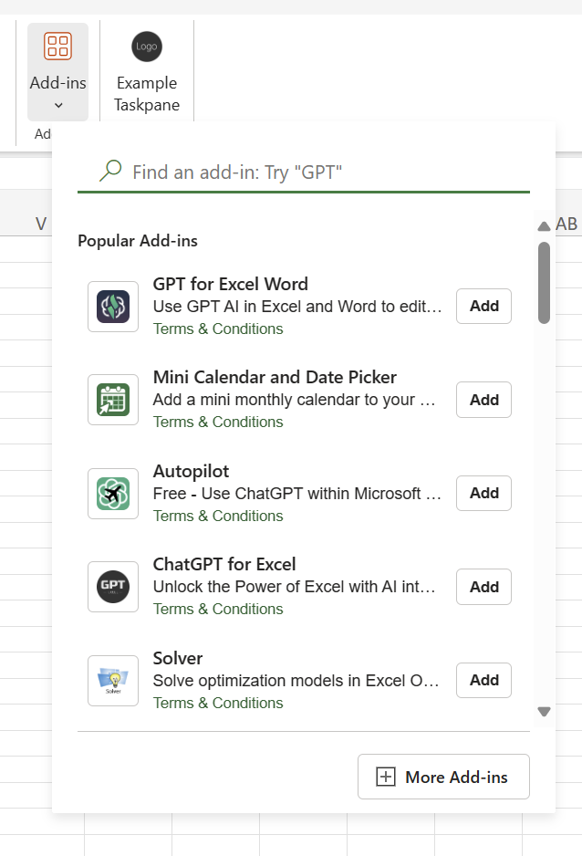
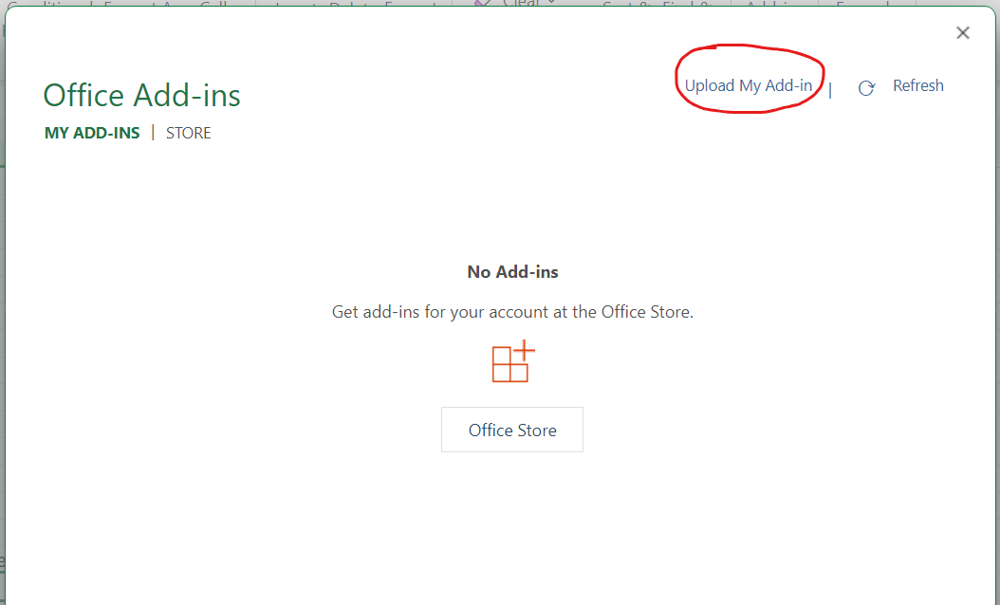
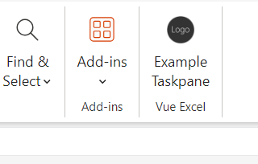
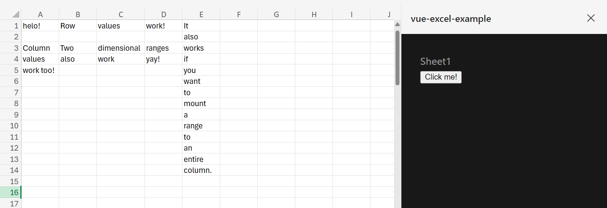

# vue-excel-example

This repo contains a Vue application to demonstrate how to use [vue-excel](https://github.com/demsullivan/vue-excel) to build Add-ins for Microsoft Excel.

To learn more about Vue Excel, check out the [repo](https://github.com/demsullivan/vue-excel).

## Trying the Examples

### Using Microsoft 365

The easiest way to try out the examples is with the web-based Excel, which is part of Microsoft 365.

1. Download the [example workbook](https://demsullivan.github.io/vue-excel-example/ExampleWorkbook.xlsx)
2. Download the [manifest file](https://raw.githubusercontent.com/demsullivan/vue-excel-example/main/manifest.xml)
3. Open Microsoft 365, upload the example workbook, and open it in web-based Excel.
4. Click on "Add-ins" from the Home Ribbon, then "More Add-ins"

    

5. Select "My Add-ins" then "Upload My Add-in" at the top-right

    
6. Select the manifest file that you downloaded

7. Now the Vue Excel button will appear in the Home Ribbon

    

8. Clicking on the Vue Excel button will make the examples Taskpane appear

    

### Using Excel Desktop

1. Download the [example workbook](https://demsullivan.github.io/vue-excel-example/ExampleWorkbook.xlsx)
2. Download the [manifest file](https://raw.githubusercontent.com/demsullivan/vue-excel-example/main/manifest.xml)